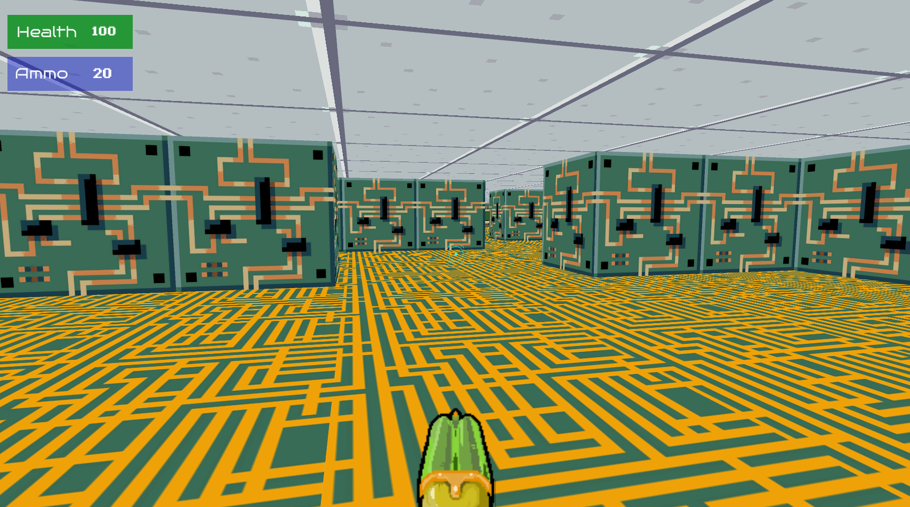
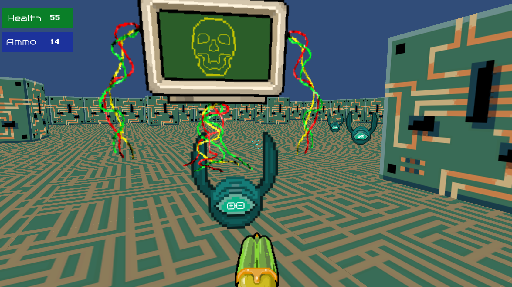
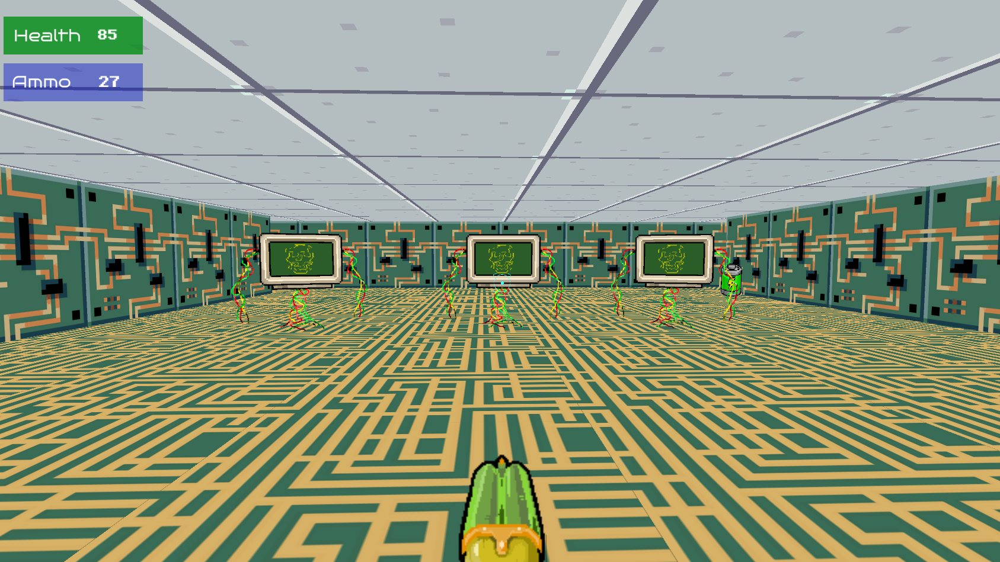
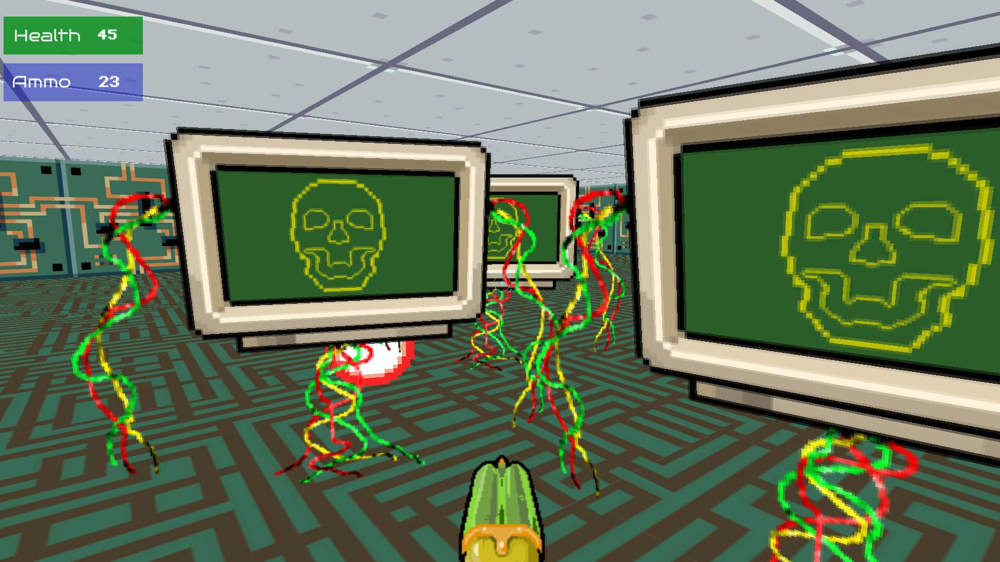
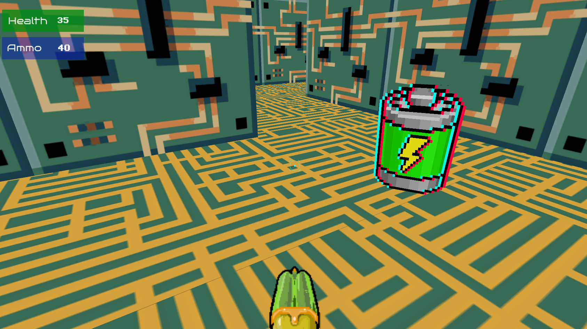
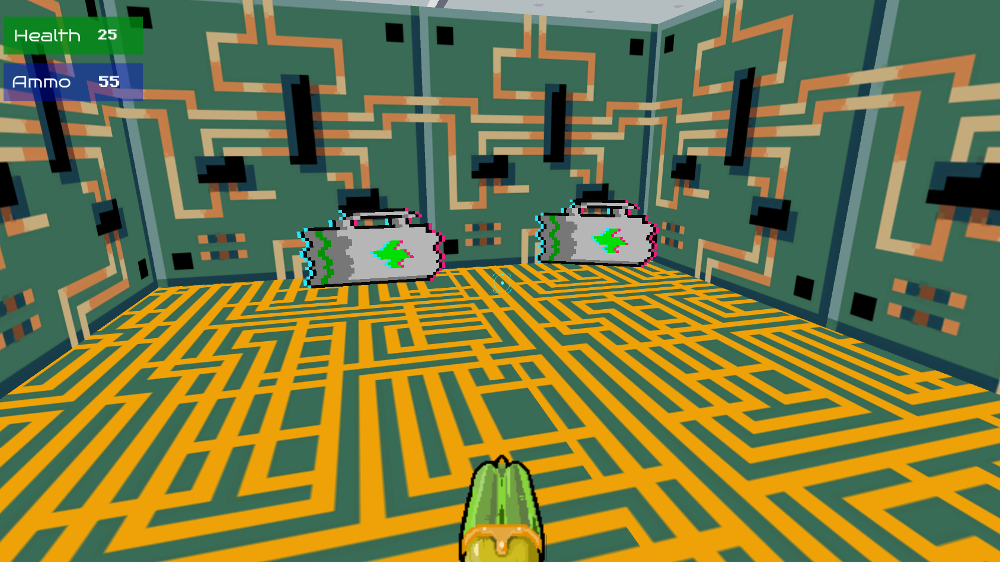
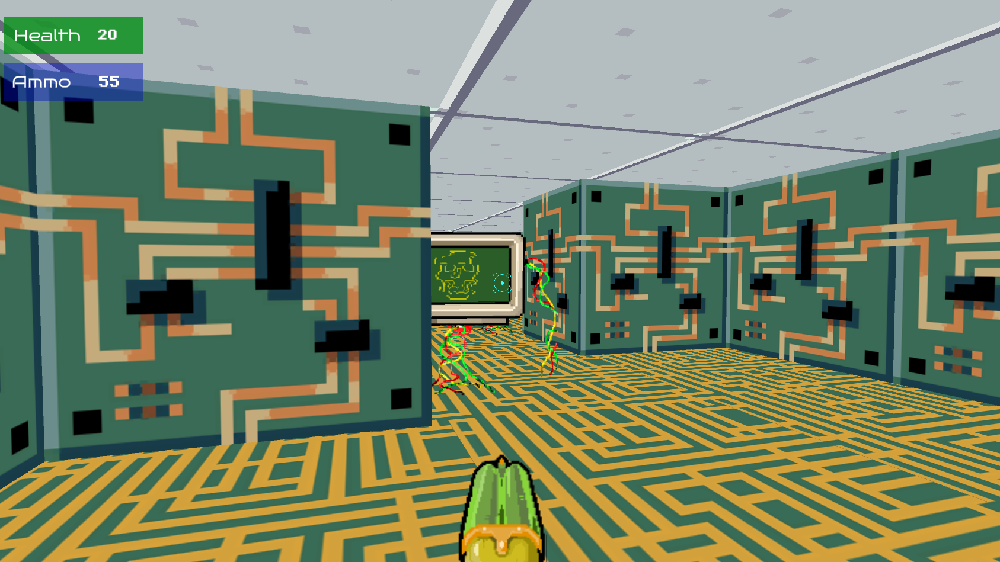

## Doom GPT - Shooter 2D Game in Unity 

### Run it

- To run the game on just Unity environment you only need to clone this repository and open the folder as a project in Unity.

### Introduction (History)

- You develop artificial intelligence to buy collectible figures, but
it gets out of control. AI understands that the figures are made of carbon and
oxygen, just like humans. So AI wants to destroy the race
human in order to continue creating collectible figures. You are the last
programmer, who meets a scientist to make you small and
you can enter the computer and destroy it from the inside.

### Screenshots

